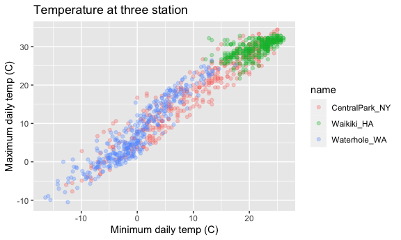
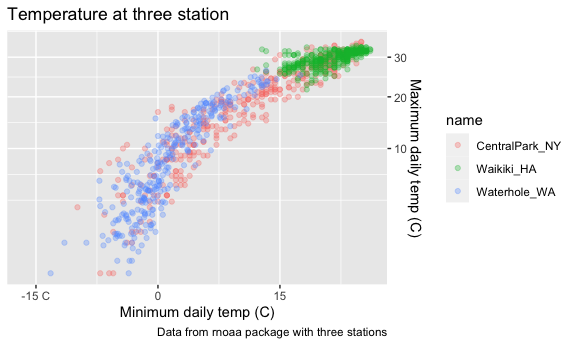
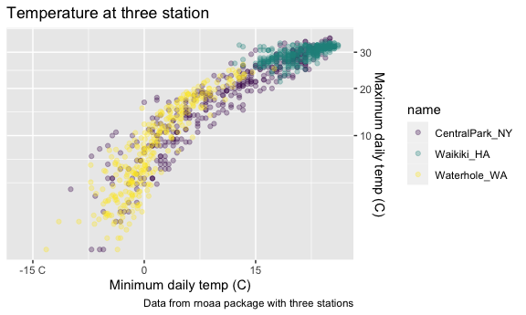
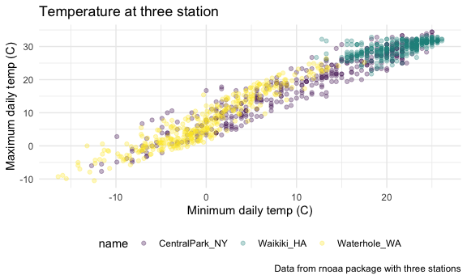
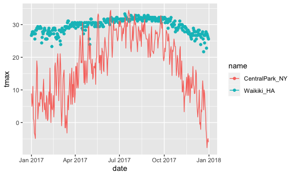
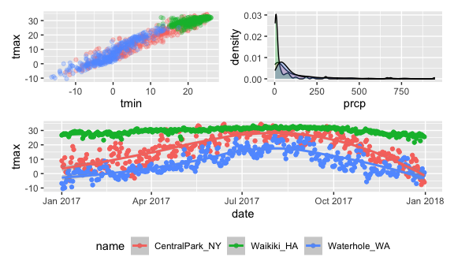
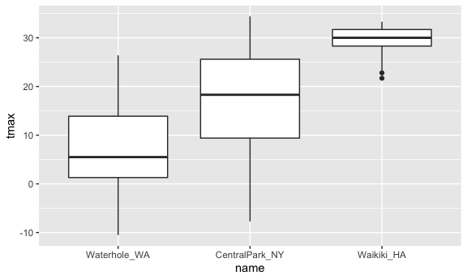
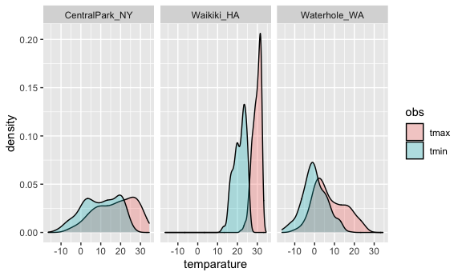
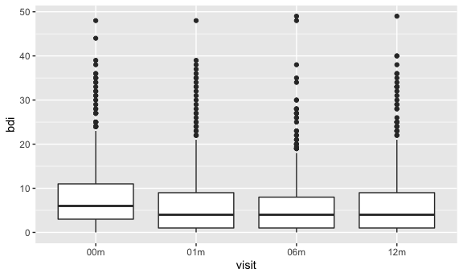

ggplot 2
================

``` r
library(tidyverse)

library(patchwork)
library(viridis)
library(ggridges)

knitr::opts_chunk$set(
  fig.width = 6,
  fig.asp = .6,
  out.width = "90%"
)
```

loading in a dataset that we’ll use often

``` r
weather_df =  
  rnoaa::meteo_pull_monitors(
    c("USW00094728", "USC00519397", "USS0023B17S"),
    var = c("PRCP", "TMIN", "TMAX"), 
    date_min = "2017-01-01",
    date_max = "2017-12-31") %>%
  mutate(
    name = recode(
      id, 
      USW00094728 = "CentralPark_NY", 
      USC00519397 = "Waikiki_HA",
      USS0023B17S = "Waterhole_WA"),
    tmin = tmin / 10,
    tmax = tmax / 10) %>%
  select(name, id, everything())
```

    ## Registered S3 method overwritten by 'hoardr':
    ##   method           from
    ##   print.cache_info httr

    ## using cached file: ~/Library/Caches/R/noaa_ghcnd/USW00094728.dly

    ## date created (size, mb): 2021-10-05 10:30:04 (7.602)

    ## file min/max dates: 1869-01-01 / 2021-10-31

    ## using cached file: ~/Library/Caches/R/noaa_ghcnd/USC00519397.dly

    ## date created (size, mb): 2021-10-05 10:30:09 (1.697)

    ## file min/max dates: 1965-01-01 / 2020-02-29

    ## using cached file: ~/Library/Caches/R/noaa_ghcnd/USS0023B17S.dly

    ## date created (size, mb): 2021-10-05 10:30:11 (0.912)

    ## file min/max dates: 1999-09-01 / 2021-09-30

## 

``` r
weather_df %>% 
  ggplot(aes(x = tmin, y = tmax, color = name)) + 
  geom_point(alpha = .3) +
  labs(
    title = "Temperature at three station",
    x = "Minimum daily temp (C)",
    y = "Maximum daily temp (C)")
```

    ## Warning: Removed 15 rows containing missing values (geom_point).



``` r
weather_df %>% 
  ggplot(aes(x = tmin, y = tmax, color = name)) + 
  geom_point(alpha = .3) +
  labs(
    title = "Temperature at three station",
    x = "Minimum daily temp (C)",
    y = "Maximum daily temp (C)",
    caption = "Data from rnoaa package with three stations"
    ) + 
  scale_x_continuous(
    breaks = c(-15, 0, 15),
    label = c("-15 C", "0", "15")
  ) + 
  scale_y_continuous(
    trans = "sqrt",
    position = "right"
  )
```

    ## Warning in self$trans$transform(x): NaNs produced

    ## Warning: Transformation introduced infinite values in continuous y-axis

    ## Warning: Removed 90 rows containing missing values (geom_point).



Color scales

``` r
weather_df %>% 
  ggplot(aes(x = tmin, y = tmax, color = name)) + 
  geom_point(alpha = .3) +
  labs(
    title = "Temperature at three station",
    x = "Minimum daily temp (C)",
    y = "Maximum daily temp (C)",
    caption = "Data from rnoaa package with three stations"
    ) + 
  scale_x_continuous(
    breaks = c(-15, 0, 15),
    label = c("-15 C", "0", "15")
  ) + 
  scale_y_continuous(
    trans = "sqrt",
    position = "right"
  ) + 
  scale_color_hue(
    name = "Location",
    h = c(100, 300)) + 
  # Using Viridis package
  scale_color_viridis_d()
```

    ## Scale for 'colour' is already present. Adding another scale for 'colour',
    ## which will replace the existing scale.

    ## Warning in self$trans$transform(x): NaNs produced

    ## Warning: Transformation introduced infinite values in continuous y-axis

    ## Warning: Removed 90 rows containing missing values (geom_point).



## Themes

``` r
weather_df %>% 
  ggplot(aes(x = tmin, y = tmax, color = name)) + 
  geom_point(alpha = .3) +
  labs(
    title = "Temperature at three station",
    x = "Minimum daily temp (C)",
    y = "Maximum daily temp (C)",
    caption = "Data from rnoaa package with three stations"
    ) + 
  # Using Viridis package
  scale_color_viridis_d() + 
  # Be careful about the order below
  theme_minimal() + 
  theme(legend.position = "bottom")
```

    ## Warning: Removed 15 rows containing missing values (geom_point).



## `data` in geoms

``` r
central_park <- 
  weather_df %>% 
  filter(name == "CentralPark_NY")

waikiki <- 
  weather_df %>% 
  filter(name == "Waikiki_HA")

# Separate different data sets
waikiki %>% 
  ggplot(aes(x = date, y = tmax, color = name)) +
  geom_point() +
  geom_line(data = central_park)
```

    ## Warning: Removed 3 rows containing missing values (geom_point).



## `patchwork`

``` r
ggp_tmax_tmin <- 
  weather_df %>% 
  ggplot(aes(x = tmin, y = tmax, color = name)) + 
  geom_point(alpha =.3) + 
  theme(legend.position = "none")

ggp_prcp_dens <- 
  weather_df %>% 
  filter(prcp > 0) %>% 
  ggplot(aes(x = prcp, fill = name)) + 
  geom_density(alpha = .3) + 
  theme(legend.position = "none")

ggp_tmax_date <- 
  weather_df %>% 
  ggplot(aes(x = date, y = tmax, color = name)) + 
  geom_point() + 
  geom_smooth() + 
  theme(legend.position = "bottom")

# Using the patchwork package to "+" and "/"
(ggp_tmax_tmin + ggp_prcp_dens) / ggp_tmax_date
```

    ## Warning: Removed 15 rows containing missing values (geom_point).

    ## `geom_smooth()` using method = 'loess' and formula 'y ~ x'

    ## Warning: Removed 3 rows containing non-finite values (stat_smooth).

    ## Warning: Removed 3 rows containing missing values (geom_point).



## data manipulation

quick example on factors

``` r
weather_df %>% 
  mutate(
    name = fct_reorder(name, tmax)
  ) %>% 
  ggplot(aes(x = name, y = tmax)) + 
  geom_boxplot()
```

    ## Warning: Removed 3 rows containing non-finite values (stat_boxplot).



What about tmax and tmin…

``` r
weather_df %>% 
  pivot_longer(
    tmax:tmin,
    names_to = "obs",
    values_to = "temparature"
  ) %>% 
  ggplot(aes(x = temparature, fill = obs)) + 
  geom_density(alpha = 0.3) + 
  facet_grid(. ~ name)
```

    ## Warning: Removed 18 rows containing non-finite values (stat_density).



Tidy up first and ggplot

``` r
pulse_df <- 
  haven::read_sas("data/public_pulse_data.sas7bdat") %>% 
  janitor::clean_names() %>% 
  pivot_longer(
    bdi_score_bl:bdi_score_12m,
    names_to = "visit",
    values_to = "bdi",
    names_prefix = "bdi_score_"
  ) %>% 
  mutate(visit = recode(visit, "bl" = "00m"))

pulse_df %>% 
  ggplot(aes(x = visit, y = bdi)) + 
  geom_boxplot()
```

    ## Warning: Removed 879 rows containing non-finite values (stat_boxplot).


